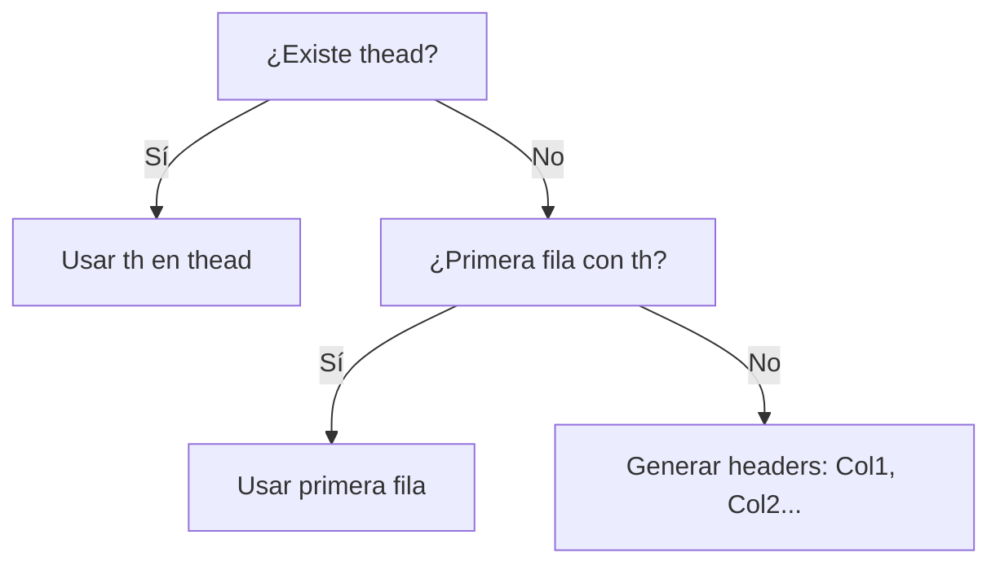
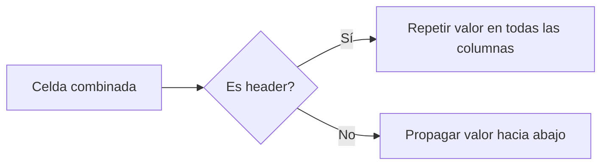

# Extract data from HTML tables

Permite extraer información (array JSON) valores de tablas HTML usando el plugin `extract_table_selenium`.

## Plugin
`extract_table_selenium`

## Uso

```json
{
    "plugin": {
        "name": "extract_table_selenium",
        "command": "extract_table",
        "config": {
            "selector": "table",
            "config": {
                "headers": "first_row",
                "format": "objects",
                "scope": "tbody"
            },
            "result": "table_data"
        }
    }
}
```

## Configuración Detallada para `extract_table`

Aquí está la especificación completa para el objeto `config`, con todas las opciones posibles y sus combinaciones:

### 1. Configuración Básica
```json
"config": {
    "selector": "table",
    "config": {
        "headers": "first_row",
        "format": "objects",
        "scope": "tbody"
    },
    "result": "table_data"
}
```

**Opciones para `headers`:**

| Valor | Descripción | Ejemplo |
| --- | --- | --- |
| `"first_row"` | Usa la primera fila como encabezados (default) | `["Nombre", "Precio"]` |
| `"none"` | Sin encabezados, usa índices numéricos | `[0, 1, 2]` |
| `["col1", "col2"]` | Array personalizado de nombres | `["Producto", "Valor"]` |
| `"skip"` | Ignora fila de encabezados sin usarla | -  |

**Opciones para `format`:**

| Valor | Descripción | Estructura de Salida |
| --- | --- | --- |
| `"objects"` | Array de objetos (default) | `[{"col": "val"}, ...]` |
| `"arrays"` | Array de arrays | `[["val1", "val2"], ...]` |
| `"key_value"` | Objeto con clave primaria | `{"key1": {data}, ...}` |

**Opciones para `scope`:**

| Valor | Descripción | Selector Equivalente |
| --- | --- | --- |
| `"tbody"` | Solo cuerpo de tabla (default) | `table tbody` |
| `"thead"` | Solo encabezados | `table thead` |
| `"tfoot"` | Solo pie de tabla | `table tfoot` |
| `"all"` | Toda la tabla | `table` |
| `".custom-class"` | Selector CSS personalizado | -  |

### 2. Filtrado Avanzado (`filters`)

```json
"config": {
    "selector": "table",
    "config": {
        "headers": "first_row",
        "format": "objects",
        "scope": "tbody"
    },
    "filters": {
        "skip_rows": 2,
        "max_rows": 10,
        "skip_columns": [0, 3],
        "required_columns": [1, 2],
        "row_condition": "{{row[0]}} != 'Total'",
        "row_index": "even"
    },
    "result": "filtered_data"
}
```

**Opciones completas:**

| Clave | Tipo | Valores | Descripción |
| --- | --- | --- | --- |
| `skip_rows` | integer | `0`-`n` | Filas iniciales a saltar |
| `max_rows` | integer | `1`-`n` | Máximo de filas a extraer |
| `skip_footer` | integer | `0`-`n` | Filas finales a saltar |
| `skip_columns` | array | `[0,2,4]` | Índices de columnas a excluir |
| `required_columns` | array | `[1,3]` | Columnas que deben tener datos |
| `row_condition` | string | Expresión | Filtrar filas por condición |
| `row_index` | string | `"all"`, `"even"`, `"odd"` | Filtrar por posición |
| `min_columns` | integer | `2`-`n` | Mínimo de columnas por fila |

**Palabras clave para `row_condition`:**

```js
"{{row[0]}} > 100"
"{{row.Nombre}} == 'Apple'"
"{{index}} % 2 == 0"
"{{values[2]}} != null"
```

### 3. Transformaciones de Datos (`transform`)

```json
"config": {
    "selector": "table",
    "config": {
        "headers": "first_row",
        "format": "objects",
        "scope": "tbody"
    },
    "transform": {
        "columns": {
            "1": "parse_int",
            "Precio": "parse_currency(USD)",
            "Fecha": "parse_date(%d/%m/%Y)",
            "Descripción": "trim"
        },
        "custom": {
            "ID": "generate_uuid()",
            "Descuento": "{{row.Precio}} * 0.1"
        },
        "rename": {
            "NombreProducto": "Producto",
            "0": "Índice"
        }
    },
    "result": "transformed_data"
}
```

**Funciones disponibles para `columns`:**

| Función | Parámetros | Descripción |
| --- | --- | --- |
| `parse_int` | -  | Convertir a entero |
| `parse_float` | -  | Convertir a decimal |
| `parse_currency` | `(USD | EUR | GBP)` | Convertir moneda |
| `parse_date` | `formato` | Convertir fecha |
| `trim` | -  | Eliminar espacios |
| `lowercase` | -  | Minúsculas |
| `uppercase` | -  | Mayúsculas |
| `regex_replace` | `patrón` | Reemplazar regex |
| `sub_string` | `inicio, fin` | Extraer subcadena |
| `default` | `valor` | Valor por defecto |

**Palabras clave para `custom`:**

```js
"generate_uuid()"
"now(%Y-%m-%d)"
"{{row.Col1}} + {{row.Col2}}"
"{{index}} + 1000"
```

### 4. Manejo de Tablas Complejas (`complex`)

```json
"config": {
    "selector": "table",
    "config": {
        "headers": "first_row",
        "format": "objects",
        "scope": "tbody"
    },
    "complex": {
        "colspan": "merge",
        "rowspan": "fill",
        "split_merged_rows": true,
        "ignore_empty_rows": true,
        "header_depth": 2,
        "multi_header_strategy": "combine"
    },
    "result": "complex_data"
}
```

**Opciones detalladas:**

| Clave | Valores | Descripción |
| --- | --- | --- |
| `colspan` | `"merge"`, `"skip"`, `"null"` | Manejo de celdas combinadas horizontalmente |
| `rowspan` | `"fill"`, `"skip"`, `"null"` | Manejo de celdas combinadas verticalmente |
| `split_merged_rows` | `bool` | Dividir filas con rowspan en múltiples registros |
| `ignore_empty_rows` | `bool` | Saltar filas sin datos |
| `header_depth` | `1`-`5` | Niveles de encabezados anidados |
| `multi_header_strategy` | `"combine"`, `"hierarchy"` | Manejo de múltiples filas de encabezado |

**Estrategias para multi-header:**

```json
"combine": 
["Encabezado Principal:Subencabezado"]

"hierarchy": 
{
  "Encabezado Principal": {
    "Subencabezado1": {...},
    "Subencabezado2": {...}
  }
}
```

### 5. Validación de Datos (`validation`)

```json
"config": {
    "selector": "table",
    "config": {
        "headers": "first_row",
        "format": "objects",
        "scope": "tbody"
    },
    "validation": {
        "required": ["SKU", "Precio"],
        "unique": ["ID"],
        "types": {
            "Precio": "number",
            "Stock": "integer"
        },
        "on_error": "skip_row"
    },
    "result": "validated_data"
}
```

**Opciones:**

| Clave | Valores | Descripción |
| --- | --- | --- |
| `required` | array | Campos obligatorios |
| `unique` | array | Campos que deben ser únicos |
| `types` | objeto | Especificación de tipos por columna |
| `on_error` | `"skip_row"`, `"abort"`, `"null_value"` | Comportamiento ante errores |

**Tipos soportados:**

```js
"string", "number", "integer", "boolean", "date", "currency"
```

### 6. Paginación (`pagination`)

```json
"config": {
    "selector": "table",
    "config": {
        "headers": "first_row",
        "format": "objects",
        "scope": "tbody"
    },
    "pagination": {
        "next_page": "button.next-page",
        "max_pages": 5,
        "scroll": "infinite",
        "page_load_wait": 2000,
        "stop_condition": "contains('Fin')"
    },
    "result": "paginated_data"
}
```

**Opciones completas:**

| Clave | Valores | Descripción |
| --- | --- | --- |
| `next_page` | selector | Elemento para siguiente página |
| `max_pages` | integer | Límite de páginas a recorrer |
| `scroll` | `"button"`, `"infinite"`, `"auto"` | Método de paginación |
| `page_load_wait` | ms  | Tiempo de espera tras navegación |
| `stop_condition` | selector/expresión | Condición para detener paginación |

### Combinaciones Especiales

#### 1. Tablas con múltiples secciones:

```json
{
  "scope": "all",
  "complex": {
    "header_depth": 2,
    "multi_header_strategy": "hierarchy"
  }
}
```

#### 2. Extracción paginada con validación:

```json
{
  "pagination": {
    "next_page": "a.next",
    "max_pages": 3
  },
  "validation": {
    "required": ["ID"],
    "types": {"Precio": "currency"}
  }
}
```

#### 3. Transformación avanzada:

```json
{
  "transform": {
    "columns": {
      "Fecha": "parse_date(%Y-%m-%d, UTC)"
    },
    "custom": {
      "Año": "{{row.Fecha | date_part('year')}}",
      "IVA": "{{row.Precio * 0.21}}"
    }
  }
}
```

#### 4. Manejo de datos faltantes:

```json
{
  "transform": {
    "columns": {
      "Stock": "default(0) | parse_int"
    }
  },
  "validation": {
    "on_error": "null_value"
  }
}
```

### Palabras Clave Especiales

1. **En transformaciones:**
    
    *   `{{row}}`: Objeto completo de la fila     
    *   `{{index}}`: Índice de la fila (0-based)
    *   `{{value}}`: Valor original de la celda
    *   `{{header}}`: Nombre de la columna actual
        
2. **En condiciones:**
    
    *   `now()`: Fecha actual
    *   `today()`: Fecha de hoy
    *   `row_count()`: Total de filas procesadas
    *   `page_number()`: Número de página actual (paginación)
        
3. **Funciones de fecha:**
    
    *   `date_part('year|month|day')`
    *   `date_add(days=7)`
    *   `date_format('%Y-%m')`
        
### Resultado con Metadatos

La salida incluirá siempre un objeto con:

```json
{
  "data": [],
  "metadata": {
    "rows": 15,
    "pages": 3,
    "skipped": 2,
    "errors": [
      {
        "row": 5,
        "column": "Precio",
        "message": "Valor no numérico"
      }
    ]
  }
}
```

### Componente extract_table con Modo "Auto"

He aquí la especificación completa con el nuevo modo "auto" que analiza automáticamente la estructura de la tabla y aplica la mejor configuración de extracción:

```json
{
  "extract_table": {
    "selector": "table#products",
    "output": "products_data",
    "config": "auto"
  }
}
```

### Configuración Detallada (config como objeto)

#### 1. Modo Operación (mode)

```json
"config": {
  "mode": "auto"
}
```

#### Comportamiento en modo auto:

Analiza estructura de la tabla (thead/tbody/tfoot)
Detecta automáticamente encabezados
Identifica celdas combinadas (rowspan/colspan)
Determina tipos de datos en columnas
Aplica saneamiento básico de datos
Selecciona estrategia óptima de extracción

#### 2. Configuración Básica
```json
"config": {
  "headers": "auto",
  "format": "auto",
  "scope": "auto"
}
```

Lógica auto para:

headers:



* **format**: "objects" si se detectan headers, "arrays" si no
* **scope**: Usa tbody si existe, sino toda la tabla

#### 3. Filtrado Avanzado (filters)

```json
"filters": {
  "auto": true,
  "skip_rows": 0,
  "max_rows": null,
  "skip_columns": [],
  "required_columns": [],
  "row_condition": "",
  "row_index": "all",
  "min_columns": 2,
  "empty_row_action": "skip"
}
```

Comportamiento: **"auto"**:true:

* Salta filas con >60% de celdas vacías
* Descarta columnas con valores idénticos en todas las filas
* Elimina filas duplicadas exactas

#### 4. Transformaciones (transform)

```json
"transform": {
  "auto_types": true,
  "columns": {
    "1": "parse_int",
    "Precio": "parse_currency"
  },
  "custom": {
    "ID": "generate_uuid()"
  },
  "rename": {
    "NombreProducto": "Producto"
  }
}
```

Detección automática de tipos:

Intenta convertir en este orden:
* Monedas ($1,200.50 → 1200.50)
* Fechas comunes (2023-12-31 → DateTime)
* Números enteros/decimales
* Booleanos ("Sí"/"No" → true/false)
* Conserva como string si no puede convertir

#### 5. Manejo de Tablas Complejas (complex)

```json
"complex": {
  "auto_merge": true,
  "colspan": "merge",
  "rowspan": "fill",
  "header_depth": "auto",
  "multi_header_strategy": "combine"
}
```

Comportamiento **"auto_merge"**:true:



#### 6. Validación de Datos (validation)

```json
"validation": {
  "auto": true,
  "required": ["SKU"],
  "unique": ["ID"],
  "types": {
    "Precio": "number"
  },
  "on_error": "warn"
}
```

Validación automática incluye:

* **Columnas numéricas**: verificar que son números válidos
* **Columnas requeridas**: detectar valores vacíos
* **Unicidad**: para columnas con valores aparentemente únicos

#### 7. Paginación (pagination)

```json
"pagination": {
  "auto_detect": true,
  "next_page": "button.next-page",
  "max_pages": 5,
  "scroll": "infinite"
}
```

Detección automática de paginación:

* Busca botones comunes:("Siguiente", ">", "Next", "Page")
* Verifica patrones de URL: (page=2, /2/, p=2)

Analiza comportamientos de scroll infinito

#### 8. Perfiles Predefinidos (profile)

```json
"config": {
  "profile": "financial"
}
```

Perfiles especializados:

* **financial**: Énfasis en monedas, porcentajes, validación estricta
* **ecommerce**: Manejo de imágenes, SKUs, detección de precios
* **directory**: Manejo de contactos, emails, teléfonos
* **default**: Configuración general para tablas simples

### Ejemplos con Modo Auto

#### Ejemplo 1: Configuración mínima

```json
{
  "extract_table": {
    "selector": "table.results",
    "output": "results",
    "config": "auto"
  }
}
```

#### Ejemplo 2: Perfil especializado

```json
{
  "extract_table": {
    "selector": "table.products",
    "output": "products",
    "config": {
      "mode": "auto",
      "profile": "ecommerce",
      "pagination": {
        "auto_detect": true,
        "max_pages": 10
      }
    }
  }
}
```

#### Ejemplo 3: Validación reforzada

```json
{
  "extract_table": {
    "selector": "table.financial-data",
    "output": "financials",
    "config": {
      "mode": "auto",
      "validation": {
        "auto": true,
        "on_error": "abort"
      }
    }
  }
}
```

### Resultados del Modo Auto

La salida incluye metadatos de detección:

```json
{
  "data": [...],
  "metadata": {
    "auto_detected": {
      "structure": "standard",
      "headers_source": "thead",
      "data_types": {
        "Precio": "currency",
        "Stock": "integer"
      },
      "pagination_type": "button",
      "merged_cells_handled": true
    },
    "warnings": [
      "3 filas vacías omitidas",
      "Columna 'Descuento' convertida a decimal"
    ],
    "stats": {
      "rows_processed": 142,
      "pages_scraped": 5,
      "time_elapsed": "4.2s"
    }
  }
}
```